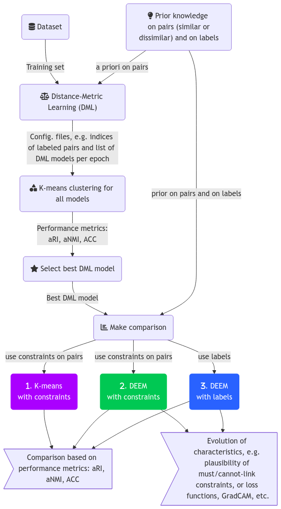

# DEEM DOCUMENTATION

## Process diagram

## Comments on functions 

For each block, here are the associated commands.

### DML 

As the code is insufficiently optimized, only one instance can be launched per GPU. To launch the calculation of a DML model on a given game and for a given a priori, use the following command (for example, for the MNIST game):

`python3 Contrastive_DML_main.py -json config_DML_mnist.json`

where `.json` is the configuration file containing 
- `modelnamefile` : the project name. This name will be used as a prefix for output file names. 
- `path_to_images` : the path to the training set.
- `supervised_prob` : the amount of a priori in the form of a probability corresponding to labeling an image. The list of labeled images is stored in a file. When generating mini-batches in `CombinedSemiSupervisedTripletDataset`, if a drawn image is labeled, then a triplet (A,P,N) is created in a supervised way, i.e. the negative is a true negative. Otherwise, a triplet is created by random drawing (so the negative can be a negative or a positive). 

- `num_epochs`: the number of epochs. There is a method implementing an *early stopping* mechanism which inspects the sliding average of the loss function over 5 consecutive iterations and stops training if it remains below 1/20000. The window size and threshold are set *hard* in the `Contrastive_DML_main.py` code.
- `batch_size` : the number of image pairs in the mini-batches at each iteration.
- `margin`: the margin used in *contrastive loss*.
- `output_shape` : size of images after transformation. DML applies operations to generate positives and negatives, including dimension reduction if required. In the case of MNIST, the transformations applied are `transforms.RandomRotation(10)`, `transforms.GaussianBlur(kernel_size=(5, 9), sigma=(0.1, 5.))`. 

The DML code allows you to modify many things, such as the optimizer (ADAM by default), the scheduler (constant by default) and the learning rate (set to 0.001 by default). 

The following code automates, via a linux `bash`, the launch of different a priori sequentially. It allows multiple instances to be launched, but as mentioned above, this is slower:

`./run_parallel.sh`

The result is a set of files, some of whose names depend on `modelnamefile` (used mainly as a prefix), e.g. below the prefix is `model_DML0.5`:
- a file for the model obtained at each epoch, e.g. `DML_model_epoch_0020.pth`.
- a file storing the state of the optimizer (checkpoint) at each epoch, e.g. `checkpoint_0020.pth`.
- a file with the path of the labeled data, `model_DML0.5_labeled_file_paths.txt` used to check that the paths correspond between DML and DEEM (not used).
- a `model_DML0.5.pth` file containing the final model (last iteration).
- The files `model_DML0.5_indicesOfPairs.pt` and `model_DML0.5_boolSimilarOfPairs.pt` respectively contain the indices of the labeled images used in the triplet (A,P,N), and the associated Booleans (to determine whether the pair is similar or dissimilar).
- At the end of training, we calculate the mean and variance of the model outputs, the associated vectors being stored in `model_DML0.5_batch_mean.pt` and `model_DML0.5_batch_stddev.pt`. This information used to be used in DEEM (to normalize), but is no longer used. This information is also calculated during training, and the associated vectors are stored in `model_DML0.5_running_mean.pt` and `model_DML0.5_running_stddev.pt`. This information was used in DEEM, which is no longer the case either.
- `model_DML0.5_input_shape.json` gives the size of the input images.
- `model_DML0.5_labeled_indices.pt` the indices of the images randomly drawn to be labeled. If `supervised_prob` is 0.5 then $50\%$ of the training images will be labeled and so this vector will contain that many indices.
- `model_DML0.5_percentiles_dict.json` contains distance statistics on the training data after DML. These percentiles can be used in DEEM to normalize distances (see article). In NN-EVCLUS, the 90th percentile is used. It is found in `prct90th_alldist` where `all_dist` means that all distances were used, without distinguishing whether the entries were similar or not. The dictionary contains the 10th (`prct10th_alldist`), the minimum (`min_alldist`), the maximum (`max_alldist`), the first (`prct1th_alldist`), the 99th (`prct99th_alldist`), the 5th (`prct5th_alldist`), and the 95th (`prct95th_alldist`). The percentages of distances in the case where images are similar (resp. dissimilar) are given in `prct_x_samedist` and `prct_x_diffdist` (are used to validate the code by checking that these distances are indeed disjoint after training), not used in DEEM. 

These files will be used in DEEM if DEEM is activated with DML.
Other files are created, such as figures showing the evolution of distance distributions for N or P data, etc.  

## Kmeans 

Once the DML models have been obtained, we can evaluate the performance of Kmeans for each model in order to select the best one. Remember that DML has been trained for a given a priori and that the files are located in a folder. The number of a priori can be varied, and a folder is available for each case. You can then run the `./run_eval_multiple.sh` script on the root folder, which runs `Contrastive_DML_eval.py` on all sub-folders. The evaluation will generate a `performance_metrics_p0.5.csv` file (if the a priori is 0.5, for example) containing the aRI, aNMI and ACC metrics for training and test data. It is necessary to specify in the code where the training and test data are located. These paths could have been put in a configuration file, but this was not done (*to be done...*). The performance file contains as many lines as there are eras. At the end of the script, you can analyze the results.

## Best model 

The `tracer_perf.py` code displays performance curves as a function of time for each a priori. A figure is generated, for example `performance_metrics_p0.5_plot.png` saved in the folder corresponding to the a priori. From these curves we "manually" select an era and the associated DML model. These curves show the test data, but of course the choice must be made for the training data. Manually, it is necessary to duplicate the file of an a priori by selecting the right model. The name of the model is important, as there is a link between the name of the DML folder and the file names, then between the DML file names and those used by DEEM. It is therefore advisable to rename this model `modelnamefile`.pth, as it is this file that will be read by DEEM. Overwrite the existing file (corresponding to the last epoch with the chosen model). 

## Comparison 

At this stage, you can run COPKMEANS, a constrained version of the K-means algorithm. You can also run DEEM with constraints on pairs or with labels:

- `python3 copkmeans.py -p /path/to/DMLrepository` launches COPKMEANS using the same constraints as DML. If DML has been trained with $10\%$ of labeled data, then the same data will be used in COPKMEANS. The code runs Kmeans++ to initialize, then K-means with constraints and K-means without constraints for comparison. The performances (aRI, aNMI, ACC for the case without and with constraints) are recorded in a `perf_copkmeans.csv` file in the DML folder. 
- python3 EVNN_main_withDML.py --jsonfile config.json` is used to launch DEEM. DEEM can be configured in a number of ways using the configuration file. To run DEEM with pair a priori, simply specify `"useDMLprior_pairs": 1` in the `.json`, while `"useDMLprior_pairs2labels": 1` allows pair a priori to be transformed into labels and used in DEEM training. If both are set to `1`, both will be used. 

In the current implementation of DEEM, there is only one loop on the training base, not two nested loops. This means that pairs are not drawn directly. A DEEM epoch is not a real epoch in the sense that we haven't run through all the pairs. For each image, DEEM draws a second, different image. If a pair a priori is imposed, the second image is of the same label, and vice versa. This pair will then be used in a specific loss if the pair is labeled. Similarly, if the label must be known, then the label is used in a specific loss for that image. If an a priori is imposed on the pairs, but no image is available in the batch with the same label (if the label is *must-link*) or a different one (if the constraint is *cannot-link*), then the pair is unsupervised. Failure to find a second image may be due to the amount of a priori (low, for example). The parameter `"prob_sampleforceDMLprior_pairs"` is a probability of constraining the drawing of a labeled pair: for example, if we set it to 0.99 and `"useDMLprior_pairs": 1` then every image in the batch will be associated with an image satisfying a constraint on the pair. We ensure that we have the maximum possible a priori (which depends on the a priori used in the DML model). If this probability is low or zero, the drawing of the second image becomes random. Given that a batch contains a limited number of images, if the number of classes is relatively large (e.g. 10 in MNIST), it is more likely that a *cannot-link* pair will be found. 

## DEEM setting

The degrees of freedom in the DEEM setting can be modified in the configuration file: 

- "training_mode": "DML" if DML is used, otherwise "training_mode": "PRECOMPUTED_EMBEDDINGS" to use precomputed embeddings (e.g. TSNE), in which case give path "jsonfile_precompEmbeddings": "Base+tSNE/embedding.json" (and give a path to the corresponding train/test/val images, files in the same order).
- The training data must be the same as in DML: when DML is launched, the images are sorted so that the indices can be saved and reused in DEEM. The same path must therefore be provided.
- We can also use a validation folder, from which we can stop the algorithm by `early_stopping`. A version based on gradient norm thresholding is implemented.
- The output folder is generated in `EVNN_config.py`, the name is created from `model_name_DML` and `tb_filesuffix` followed by `DEEM_repo`. At the end of the program, the DEEM model and optimizer state are saved. 
- DEEM generates data in tensorboard whose file name contains the suffix `tb_filesuffix` stored in a folder inside the previous folder. This file contains a wealth of information relating to model performance.
- The parameters `"base_learning_rate": 0.0001`, `"batch_size": 128`, `"num_epochs": 750`, `"nitermax": 200000` speak for themselves.
- `probprior` is a probability of randomly drawing a labeled image. This probability **may** add a priori factors in addition to those included in DML. If, for example, DML has been trained with few a priori, such as 0.001, but if `"probprior": 0.5` then DEEM will randomly draw images which in $50%$ of cases will be labeled. These labels are drawn from the training database, and may or may not be common to those of DML.
- Concerning a priori
  - "probprior": 0.0, ⇒ if > 0.0 then DEEM will randomly draw images which it will label and use for training (none if 0.0). The a priori vector is fixed at startup. 
  - "useDEEMprior_pair": 0, ⇒ if 1 and if probprior > 0.0 then DEEM will use the vector of previous a priori to label pairs and use a criterion based on plausibilities to help DEEM converge
  - useDEEMprior_label": 0, ⇒ if 1 and if probprior > 0.0 then DEEM will use the vector of previous a priori to label images and use another criterion (based on plausibilities) to help DEEM converge
  - prob_sampleforce_DEEM_pairs": 0.9, ⇒ forces DEEM to use a priori at each iteration (if probprior > 0.0)
  - "useDMLprior_pairs2labels": 0, ⇒ Instructs DEEM to use the a priori used in DML by transforming them into a priori on labels (single images, not pairs)
  - "useDMLprior_pairs": 1, ⇒ Instructs DEEM to use a priori on pairs used in DML 
  - "prob_sampleforceDMLprior_pairs": 0.99, ⇒ forces DEEM to use a priori at each iteration.
So if probprior = 0.0 (note that this is a float!), you can ask DEEM to use only the DML a priori, or none if the last 3 are set to 0/0/0.0. 
- The number of classes in the problem is set in `numclasses`. It would have been possible to find this from the data path, but that's how it's done. The number of focal elements is fixed in `.json`, e.g. `"nbfocsets": 57` in MNIST. There is no function that automatically generates the **C** matrix used in Thierry Denoeux's article to calculate the conflict matrixically. The Matlab version of DEEM does this, but it has not yet been implemented in DEEM. **TO BE DONE...**. The matrix is currently loaded from a .mat file to be supplied.
- `input_shape` is the size of the input data, e.g. [1, 28, 28] for MNIST.
- `"network": "resnet18"` allows you to use the pre-trained Resnet18 model, while `"network": "simple1"` uses a simple model (which must be adapted to the size of the images).
- scheduler" lets you modify the scheduler, e.g. ‘ConstantLR’, while ‘optimizer’: ‘adam’ lets you choose the optimizer. 
- Via `loss_evnn` and `loss_prior` it is possible to change the loss for distance loss (e.g. MSE) and for a priori loss (e.g. MSE).

Early stopping is coded as *hard*. For the moment, a threshold on the gradient norm is set via `gradient_norm_threshold = 0.05` and `patiencegradnorm = 5`: the principle is to smooth the gradient norm by average over 10 measurements, to inspect whether or not the norm evolves around this average and if this variation is below the threshold `0.05` during `5` iterations then the algorithm stops. **TO BE DONE: integrate these parameters into the .json file**. The validation loss history is accessible, but no early stopping coded on this variable for the moment (several unsuccessful attempts). Similarly, we have access to ACC, ARI and NMI validation metrics, which could be used for this purpose. 

## Analysis of results

Once DEEM has been run on the various DML models, depending on the a priori, we have a set of directories with the results stored in `tensorboard` files. You can then compare DEEM's performance, for example by plotting the metrics against the a priori. To do this, run `python3 read_tb_logs4.py`, which generates a `performances.csv` file containing the metrics and a priori. 

## Example 

In the folder provided, the MNIST images have been placed in the "mnist/train", "mnist/test", "mnist/validation" folders. Validation data were drawn randomly from *train* (with code `creervaldatase.py`). In DML, *test* and *valid* are useless. Run DML with the configuration file provided: 

`python3 Contrastive_DML_main.py --jsonfile config_DML.json`

In this example, the number of epochs has been deliberately reduced to 2 for illustrative purposes (20 epochs were used in the article). The final learning phase is a little time-consuming: the model is evaluated on numerous pairs to deduce certain statistics. 
Once the code is complete, we have two folders: one for the *tensorboard* data (here "*logdir_tb_dml*") and one for the files usable in DEEM (here "*mnist_m8_5epochs_repo*"). 

You can now run the evaluation with Kmeans. Beforehand, the DML folder has been moved to a "test" folder. Kmeans will be applied to the training data. The estimated Kmeans model (centers) is then used to predict on the test data ("generalization"). The command :

`python3 Contrastive_DML_eval.py -d 'mnist' -p 0.5 -f 'perftmp.csv' -m 'test/mnist_m8_5epochs_repo/mnist_m8_5epochs.pth' -o 'test/mnist_m8_5epochs_repo/' -l '../mnist/train' -t '../mnist/test'` 

where *p* is used simply to name a file (here we had chosen 0.5 in config_DML.json) and to include the value in a result file (.csv) which can be used later to analyze performance; *mnist_m8_5epochs. pth* is the model saved at the last epoch (you can take a model at any iteration); the *-d* option only works with MNIST for the moment; the *-o* option allows you to set the folder where to save the evaluation results, which include various figures, as well as embeddings on the training data. These embeddings will eventually be used in DEEM. Be careful not to change the order of the images in the directories between DEEM and DML!
The "perf" .csv can be placed in a separate folder. If this is done for several folders (i.e. several DML models), perf can be traced with `tracer_perf`. 

DEEM can now be launched. Several tests have been planned for illustrative purposes. Test 1 ⇒ If we wish to impose the use of DML results in DEEM, exploiting DML a priori in the form of a priori on pairs then run : 

`python3 EVNN_main_withDML.py --jsonfile config_mnist_test1.json`

In these configurations: "probprior": 0.0, "useDEEMprior_pair": 0, "useDEEMprior_label": 0, "prob_sampleforce_DEEM_pairs": 0.0, "useDMLprior_pairs2labels": 0, "useDMLprior_pairs": 1, "prob_sampleforceDMLprior_pairs": 0.99. So no additional a priori (probprior=0.0) other than those of DML are used. These a priori are on pairs (useDMLprior_pairs=1). 
If you wish to impose the use of DML results in DEEM, exploiting DML a priori in the form of a priori on images and no longer on pairs, set: "probprior": 0. 0, "useDEEMprior_pair": 0, "useDEEMprior_label": 0, "prob_sampleforce_DEEM_pairs": 0.0, "useDMLprior_pairs2labels": 1, "useDMLprior_pairs": 0, "prob_sampleforceDMLprior_pairs": 0.99. So no additional a priori (probprior=0.0) other than those of DML are used. These a priori are on individual images, not on pairs. 
In this way, we use the same a priori as for DML.

In the case of DML, DEEM uses the embeddings generated by the DML at each iteration. If we do not wish to use DML but only DEEM, we can precompute embeddings, for example, using t-SNE. This facilitates DEEM's clustering process since distances between images are computed in a smaller space where dissimilarities are more easily measured. To achieve this, let's consider an image dataset, such as 5000 "train" images from MNIST (see on GITHUB/data). We run a t-SNE (other methods could also be used...). It is essential to preserve the row order in the t-SNE output matrix so that row i corresponds to image i in the dataset. The embeddings are then saved, for instance, in a JSON file. An example is provided in Python/data/Base+tSNE/embedding.json, corresponding to the embeddings of images in Python/data/Base+tSNE/train/. DEEM loads pairs of images from the train/ folder, retrieves the corresponding embeddings from the JSON file, and computes the distance in this space. Ultimately, DEEM aims to cluster the images. The labels are provided in the folder to test semi-supervised learning, as described in the article. One way to do it is:

`python3 EVNN_main_withDML.py --jsonfile config_mnist_tsne0.1.json`

where "training_mode": "PRECOMPUTED_EMBEDDINGS", "model_path_DML": "", "model_name_DML": "", "image_folder_train": "../data/Base+tSNE/train", "image_folder_test": "data/Base+tSNE/test/", "image_folder_valid": "", "jsonfile_precompEmbeddings": "data/Base+tSNE/embedding.json", "probprior": 0.4, "useDEEMprior_pair": 1, "useDEEMprior_label": 0, "prob_sampleforce_DEEM_pairs": 0.9. So the model will be trained with images and t-SNE with $40\%$ of prior. In this configuration file, ResNet18 is used as the backbone.