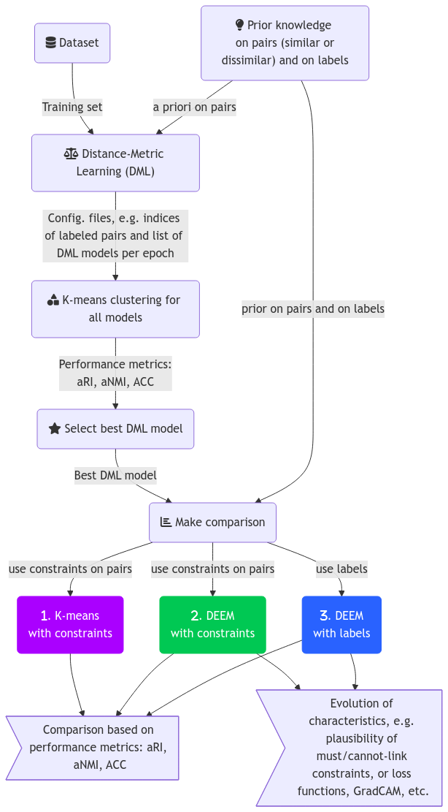

# DOCUMENTATION DE DEEM

## Schéma du Processus

## Commentaires sur les fonctions 

Pour chaque bloc, voici les commandes associées.

### DML 

Le code étant insuffisamment optimisé, on ne peut lancer qu'une seule instance par GPU. Pour lancer le calcul d'un modèle DML sur un jeu donné et pour un a priori donné on utilise la commande suivante (par exemple pour le jeu MNIST) :

`python3 Contrastive_DML_main.py -json config_DML_mnist.json`

où le `.json` est le fichier de configuration qui contient 
- `modelnamefile` : le nom du projet. Ce nom sera utilisé en préfix du nom des fichiers de sortie. 
- `path_to_images` : le chemin vers le jeu d'entrainement.
- `supervised_prob` : la quantité d'a priori sous la forme d'une probabilité correspondant au fait de labeliser une image. La liste des images labelisées est stockée dans un fichier. Lors de la génération des mini-batchs dans `CombinedSemiSupervisedTripletDataset`, si une image tirée est labelisée, alors on crée un triplet (A,P,N) de manière supervisée, c'est à dire que le négatif est un vrai négatif. Sinon, on créé un triplet par tirage aléatoire (donc le négatif peut être un négatif ou positif). 
- `num_epochs` : le nombre d'époque. Il y a une méthode implémentant un mécanisme d'*early stopping* qui inspecte la moyenne glissante de la fonction de perte sur 5 itérations consécutives et qui arrête l'entrainement si elle reste inférieure à 1/20000. La taille de fenêtre et le seuil sont fixés *en hard* dans le code `Contrastive_DML_main.py`.
- `batch_size` : le nombre de couples d'images dans les mini-batchs à chaque itération.
- `margin` : la marge utilisée dans la *contrastive loss*.
- `output_shape` : taille des images après transformation. DML applique des opérations pour générer des positifs et négatifs dont une réduction de dimension si cela est requis. Dans le cas de MNIST, les transformations appliquées sont `transforms.RandomRotation(10)`, `transforms.GaussianBlur(kernel_size=(5, 9), sigma=(0.1, 5.))`. 

Le code DML permet de modifier de nombreuses choses, telles que l'optimiseur (ADAM par défaut), ou le scheduler (constant par défaut), le taux d'apprentissage (fixé à 0.001 par défaut). 

Le code suivant permet d'automatiser, via un `bash` linux, le lancement pour différents a priori de manière séquentielle. Il permet de lancer plusieurs instances mais comme mentionné précédemment cela est plus lent :

`./run_parallel.sh`

Le résultat est un ensemble de fichiers dont le nom dépend pour certains de `modelnamefile` (utilisé principalement comme préfix), par exemple ci-dessous le prefix est `model_DML0.5`:
- un fichier pour le modèle obtenu à chaque époque, e.g. `DML_model_epoch_0020.pth`
- un fichier stockant l'état de l'optimiseur (checkpoint) à chaque époque, e.g. `checkpoint_0020.pth`
- un fichier avec le chemin des données labelisées, `model_DML0.5_labeled_file_paths.txt` ayant servi à contrôler que les chemins correspondent bien entre DML et DEEM (non utilisé).
- un fichier `model_DML0.5.pth` qui contient le modèle final (dernière itération).
- Les fichiers `model_DML0.5_indicesOfPairs.pt` et `model_DML0.5_boolSimilarOfPairs.pt`  contiennent respectivement les indices des images labelisées utilisées dans les triplet (A,P,N), et les booléens associés (pour savoir si la paire est similaire ou dissimilaire).
- A la fin de l'entrainement, nous calculons la moyenne et la variance des sorties du modèle, les vecteurs associés sont stockés dans `model_DML0.5_batch_mean.pt`et `model_DML0.5_batch_stddev.pt`. Ces informations étaient utilisées dans DEEM (pour normaliser), ce qui n'est plus le cas à présent. Ces informations sont également calculées au cours de l'entrainement, les vecteurs associés sont stockés dans `model_DML0.5_running_mean.pt`et `model_DML0.5_running_stddev.pt`. Ces informations étaient utilisées dans DEEM, ce qui n'est plus le cas à présent non plus.
- `model_DML0.5_input_shape.json` donne la dimension des images d'entrée.
- `model_DML0.5_labeled_indices.pt` les indices des images tirées aléatoirement pour être labelisées. Si `supervised_prob` vaut 0.5 alors $50\%$ des images d'entrainement seront labelisées et donc ce vecteur contiendra autant d'indices.
- `model_DML0.5_percentiles_dict.json` contient des statistiques des distances sur les données d'entrainement après DML. Ces pourcentiles peuvent être utilisées dans DEEM pour normaliser les distances (voir article). Dans NN-EVCLUS, le 90e pourcentile est utilisé. Il se trouve dans `prct90th_alldist` où `all_dist` signifie que toutes les distances ont été utilisées, sans distinguer le fait que les entrées étaient similaires ou non. Le dictionnaire contient le 10e (`prct10th_alldist`), le minimum (`min_alldist`), le maximum (`max_alldist`), le premier (`prct1th_alldist`), le 99e (`prct99th_alldist`), le 5e (`prct5th_alldist`), et le 95e (`prct95th_alldist`). Les pourcentiles des distances dans le cas où les images sont similaires (resp. dissimilaires) sont donnés dans `prct_x_samedist` et `prct_x_diffdist` (sont utilisées pour valider le code en vérifiant que ces distances sont bien disjointes après entrainement), non utilisées dans DEEM. 

Ces fichiers seront utilisés dans DEEM si DEEM est activé avec le DML.
D'autres fichiers sont créés tels que des figures représentant l'évolution des distributions des distances pour les données N ou P, etc.  

## Kmeans 

Une fois les modèles DML obtenus, on peut évaluer les performances du Kmeans pour chaque modèle afin de sélectionner le meilleur d'entre eux. Rappelons que DML a été entrainé pour un a priori donné et que les fichiers se trouvent dans un dossier. On peut avoir fait varier la quantité d'a priori et pour chaque cas on dispose d'un dossier. On peut alors lancer le script `./run_eval_multiple.sh` sur le dossier racine, qui lance `Contrastive_DML_eval.py` sur tous les sous-dossiers. L'évaluation va générer un fichier `performance_metrics_p0.5.csv` (si l'a priori est de 0.5 par exemple) dans lequel se trouveront les métriques aRI, aNMI, et ACC pour les données d'entrainement et de test. Il est nécessaire de spécifier dans le code où se trouve les données d'entrainement et de test. Ces chemins auraient pu être mis dans un fichier de configuration mais cela n'a pas été fait (*to be done...*). Le fichier de performances contient autant de lignes que d'époques. A la fin du script on peut analyser les résultats.

## Best model 

Le code `tracer_perf.py` affiche les courbes de performances en fonction des époques pour chaque a priori. Une figure est générée, par exemple `performance_metrics_p0.5_plot.png` enregistrée dans le dossier correspondant à l'a priori. A partir ces courbes on choisit "manuellement" une époque et le modèle DML associé. Ces courbes font apparaître les données test mais bien entendu le choix doit être fait sur les données d'apprentissage. Manuellement, il est nécessaire de dupliquer le dossier d'un a priori en sélectionnant le bon modèle. Le nom du modèle est important, il y a un lien entre le nom du dossier DML et les noms des fichiers, puis entre les noms de fichiers DML et ceux utilisés par DEEM. Il est donc conseillé de renommer ce modèle `modelnamefile`.pth, c'est ce fichier qui sera lu par DEEM. Il faut écraser le fichier existant (celui correspondant à la dernière époque par le modèle choisi). 

## Comparaison 

A cette étape on peut lancer COPKMEANS, une version avec contraintes de l'algorithme K-means. On peut également lancer DEEM avec contraintes sur les paires ou avec labels :

- `python3 copkmeans.py -p /path/to/DMLrepository` permet de lancer COPKMEANS en utilisant les mêmes contraintes que DML. Si DML a été entrainé avec $10\%$ des données labelisées alors ces mêmes données seront utilisées dans COPKMEANS. Le code lance Kmeans++ pour initialiser, puis K-means avec contraintes ainsi que K-means sans contraintes à titre de comparaison. Les performances (aRI, aNMI, ACC pour le cas sans et avec contraintes) sont enregristrées dans un fichier `perf_copkmeans.csv`dans le dossier DML. 
- `python3 EVNN_main_withDML.py --jsonfile config.json` permet de lancer DEEM. DEEM peut être paramétré de nombreuses manières à l'aide du fichier de configuration. Pour lancer DEEM avec les a priori sur les paires, il suffit d'indiquer `"useDMLprior_pairs": 1`dans le `.json`, tandis que `"useDMLprior_pairs2labels": 1` permet de transformer l'a priori sur les paires en labels et d'utiliser ces labels dans l'entrainement de DEEM. Si les deux sont fixées à `1`, les deux seront utilisés. 

Dans l'implémentation actuelle de DEEM, il n'y a qu'une seule boucle sur la base d'entrainement et non deux boucles imbriquées. Cela signifie que ne l'on ne tire pas les paires directement. Une époque de DEEM n'est pas une vraie époque dans le sens où on n'a pas parcouru toutes les paires. Pour chaque image, DEEM tire une seconde image, différente. Si un a priori sur les paires est imposé, la seconde image est du même label, et vice-versa. Cette paire sera ensuite utilisée dans une loss spécifique si la paire est labelisée. De même, si le label doit être connu alors le label est utilisé dans une loss spécifique pour cette image. Si on impose un a priori sur les paires mais qu'aucune image n'est disponible dans le batch avec le même label (si le label est *must-link*) ou un différent (si la contrainte est *cannot-link*) alors la paire est non-supervisée. Le fait de ne pas pouvoir trouver une seconde image peut venir de la quantité d'a priori (faible par exemple). Le paramètre `"prob_sampleforceDMLprior_pairs"` est une probabilité de contraindre le tirage d'une paire labelisée : par exemple si on la fixe à 0.99 et que `"useDMLprior_pairs": 1` alors chaque image dans le batch sera associée à une image satisfaisant une contrainte sur la paire. On s'assure d'avoir le maximum d'a priori possible (qui dépend de l'a priori utilisé dans le modèle DML). Si cette probabilité est faible ou nulle, le tirage de la seconde image devient aléatoire. Etant donné qu'un batch contient un nombre limité d'images, si le nombre de classes est relativement grand (par exemple 10 dans MNIST), il est plus probable de tomber sur une paire *cannot-link*. 

## Réglage de DEEM

Les degrés de liberté dans le réglage de DEEM peuvent être modifiés dans le fichier de configuration : 

- "training_mode": "DML" si DML est utilisé, sinon "training_mode": "PRECOMPUTED_EMBEDDINGS" pour utiliser des embeddings précalculés (par ex TSNE), dans ce cas donner le chemin "jsonfile_precompEmbeddings": "Base+tSNE/embedding.json" (et donner un chemin vers les images train/test/val correspondant, fichiers dans le même ordre).
- Les données d'apprentissage doivent être les mêmes que dans le DML : au lancement du DML, les images sont triés pour que les indices puissent être sauvegardés et réutilisés dans DEEM. Donc le même chemin doit être fourni.
- On peut également utiliser un dossier de validation, à partir duquel on peut arrêter l'algorithme par `early_stopping`. Une version basé sur le seuillage de la norme des gradients est implémentée.
- Le dossier de sortie est généré dans `EVNN_config.py`, le nom est créé à partir de `model_name_DML` et `tb_filesuffix` suivi de `DEEM_repo`. A la fin du programme, le modèle DEEM et l'état de l'optimiseur sont sauvergardés. 
- DEEM génère des données dans tensorboard dont le nom du fichier contient le suffix `tb_filesuffix` stocké dans un dossier à l'intérieur du dossier précédent. Ce fichier contient tout  un tas d'informations liées aux performances du modèle.
- Les paramètres `"base_learning_rate": 0.0001`, `"batch_size": 128`, `"num_epochs": 750`, `"nitermax": 200000` parlent d'eux mêmes.
- `probprior` est une probabilité de tirer aléatoirement une image labelisée. Cette probabilité **ajoute** possiblement des a priori en plus de ceux incluent dans DML. Si par exemple DML a été entrainé avec peu d'a priori, comme 0.001, mais si `"probprior": 0.5` alors DEEM va tirer aléatoirement des images qui dans $50\%$ des cas seront labelisées. Ces labels sont tirés dans la base d'entrainement, ils peuvent être communs ou non à ceux de DML.
- Concernant les a priori
  - "probprior": 0.0, ⇒ si > 0.0 alors DEEM va tirer aléatoirement des images qu'il va labeliser et utiliser pour l'apprentissage (aucune si 0.0). Le vecteur des a priori est fixé au démarrage. 
  - "useDEEMprior_pair": 0, ⇒ si 1 et si probprior > 0.0 alors DEEM va utiliser le vecteur des a priori précédents pour labeliser des paires et utiliser un critère basé sur des plausibilités pour aider DEEM à converger
  - "useDEEMprior_label": 0, ⇒ si 1 et si probprior > 0.0 alors DEEM va utiliser le vecteur des a priori précédents pour labeliser des images et utiliser un autre critère (basé sur des plausibilités) pour aider DEEM à converger
  - "prob_sampleforce_DEEM_pairs": 0.9, ⇒ force DEEM à utiliser des a priori à chaque itération (si probprior > 0.0)
  - "useDMLprior_pairs2labels": 0, ⇒ Ordonne à DEEM d'utiliser les a priori utilisés dans DML en les transformant en a priori sur les labels (images simples, pas les paires)
  - "useDMLprior_pairs": 1, ⇒ Ordonne à DEEM d'utiliser les a priori sur les paires utilisés dans DML 
  - "prob_sampleforceDMLprior_pairs": 0.99, ⇒ force DEEM à utiliser des a priori à chaque itération
Ainsi si probprior = 0.0 (attention c'est un float !) on peut demander à DEEM d'utiliser seulement les a priori du DML ou aucun si les 3 derniers sont fixés à 0/0/0.0. 
- Le nombre de classes du problème est fixé dans `numclasses`. Il aurait été possible de trouver cela à partir du chemin des données mais c'est fait ainsi. Le nombre d'éléments focaux est figé dans le `.json`, par exemple `"nbfocsets": 57`dans MNIST. Il n'y a pas de fonction qui génère automatiquement la matrice **C** utilisée dans l'article de Thierry Denoeux pour calculer matriciellement le conflit. La version Matlab de DEEM le fait mais cela n'a pas été implémenté encore dans DEEM. **TO BE DONE...**. La matrice est pour le moment chargée depuis un .mat que l'on doit fournir.
- `input_shape` est la taille des données d'entrée, par exemple [1, 28, 28] pour MNIST.
- `"network": "resnet18"` permet d'utiliser le modèle pré-entrainé Resnet18, tandis que `"network": "simple1"`utilise un modèle simple (qu'il faut adapter en fonction de la dimension des images)
- `scheduler`permet de modifier l'ordonnanceur, par exemple `"ConstantLR"`, tandis que `"optimizer": "adam"`permet de choisir l'optimiseur. 
- Via `loss_evnn` et `loss_prior` il est possible de changer les loss pour la perte liée aux distances (par exemple MSE) et pour les a priori (par exemple MSE).

Le early stopping est codé en *hard*. Pour le moment, un seuil sur la norme du gradient est fixé via `gradient_norm_threshold = 0.05` et `patiencegradnorm = 5`: le principe est de lisser par moyenne la norme du gradient sur 10 mesures, d'inspecter si la norme évolue ou non autour de cette moyenne et si cette variation est en deça du seuil `0.05` pendant `5` itérations alors l'algorithme s'arrête. **TO BE DONE : intégrer ces paramètres dans le .json.** L'historique de la loss de validation est accessible mais pas de early stopping codé sur cette grandeur pour le moment (plusieurs essais non concluants). Idem on a accès aux métriques ACC, ARI et NMI sur la validation qui pourraient être utilisées dans ce but. 

## Analyse des résultats

Une fois DEEM lancé sur les différents modèles DML, fonction des a priori, on dispose d'un ensemble de répertoires avec les résultats stockés dans les fichiers `tensorboard`. On peut alors comparer les performances de DEEM, par exemple en traçant les métriques en fonction des a priori. Pour cela, lancer `python3 read_tb_logs4.py`, cela génère un fichier `performances.csv` qui contient les métriques et les a priori. 

## Exemple 

Dans le dossier fourni, les images MNIST ont été placées dans le dossier "mnist/train", "mnist/test", "mnist/validation". Les données de validation ont été tirées aléatoirement depuis *train* (avec le code `creervaldatase.py`). Dans DML, *test* et *valid* ne servent à rien. On lance DML avec le fichier de configuration fourni : 

`python3 Contrastive_DML_main.py --jsonfile config_DML.json`

Dans cet exemple le nombre d'époques a été volontairement réduit à 2 à but illustratif (20 époques ont été utilisées dans l'article). La dernière phase de l'apprentissage est un peu  long : le modèle est évalué sur de nombreuses paires pour déduire certaines statistiques. 
Une fois le code terminé, on a deux dossiers : un pour les données *tensorboard* (ici "*logdir_tb_dml*") et un pour les fichiers utilisables dans DEEM (ici "*mnist_m8_5epochs_repo*"). 

On peut lancer l'évaluation avec Kmeans. Au préalable le dossier DML a été déplacé vers un dossier "test". Kmeans va être appliqué sur les données d'apprentissage. Le modèle Kmeans estimé (centres) est ensuite employé pour prédire sur les données de test ("généralisation"). La commande :

`python3 Contrastive_DML_eval.py -d 'mnist' -p 0.5 -f 'perftmp.csv' -m 'test/mnist_m8_5epochs_repo/mnist_m8_5epochs.pth' -o 'test/mnist_m8_5epochs_repo/' -l '../mnist/train' -t '../mnist/test'` 

où *p* est utilisé simplement pour nommer un fichier (ici on avait choisi 0.5 dans config_DML.json) et pour inclure la valeur dans un fichier de résultat (.csv) qui pourra être utilisé plus tard pour analyser les performances ; *mnist_m8_5epochs.pth* est le modèle enregistré à la dernière époque (on peut prendre un modèle à une itération quelconque) ; l'option *-d* ne fonctionne qu'avec MNIST pour le moment ; l'option *-o* permet de fixer le dossier où enregistrer les résultats de l'évaluation qui comporte différentes figures, ainsi que les embeddings sur les données d'apprentissage. Ces embeddings seront utilisés dans DEEM éventuellement. Attention à l'ordre des images dans les répertoires qui ne doivent pas changer entre DEEM et DML !
Le .csv "perf" peut être placé dans un dossier à part. Si cela est fait pour plusieurs dossiers (donc plusieurs modèles DML), on peut tracer les perf avec `tracer_perf`. 

On peut à présent lancer DEEM. Plusieurs tests ont été prévus à but illustratif. Test 1 ⇒ Si on souhaite imposer d'utiliser les résultats du DML dans DEEM, en exploitant les a priori du DML sous la forme d'a priori sur les paires alors lancer : 
`python3 EVNN_main_withDML.py --jsonfile config_mnist_test1.json`
Dans ces configuration : "probprior": 0.0, "useDEEMprior_pair": 0, "useDEEMprior_label": 0, "prob_sampleforce_DEEM_pairs": 0.0, "useDMLprior_pairs2labels": 0, "useDMLprior_pairs": 1,    "prob_sampleforceDMLprior_pairs": 0.99. Donc pas d'a priori supplémentaire (probprior=0.0) hormis ceux de DML ne sont utilisés. Ces a priori sont sur les paires (useDMLprior_pairs=1). 
Si on souhaite imposer d'utiliser les résultats du DML dans DEEM, en exploitant les a priori du DML sous la forme d'a priori sur les images et non plus sur les paires, régler : "probprior": 0.0, "useDEEMprior_pair": 0, "useDEEMprior_label": 0, "prob_sampleforce_DEEM_pairs": 0.0, "useDMLprior_pairs2labels": 1, "useDMLprior_pairs": 0,    "prob_sampleforceDMLprior_pairs": 0.99. Donc pas d'a priori supplémentaire (probprior=0.0) hormis ceux de DML ne sont utilisés. Ces a priori sont sur les images individuelles et non plus sur les paires. 
De cette manière on utilise les mêmes a priori que ceux du DML.

Dans le cas du DML, DEEM utilise les embeddings générés par le DML à chaque itération. Si maintenant on ne souhaite pas utiliser de DML mais seulement DEEM, on peut préalablement calculer des embeddings, par exemple avec t-SNE. Cela permet de faciliter le clustering de DEEM car les distances entre images sont ainsi calculées dans un espace plus petit au sein duquel les dissimarilités sont plus aisément calculées. Pour cela, considérons une base d'image, par exemple 5000 images "train" de MNIST (voir sur GITHUB/data). On lance un t-SNE (on pourrait utiliser d'autres méthodes...). Il faut préserver l'ordre des lignes dans la matrice de sortie du t-SNE de sorte à ce que la ligne i corresponde à l'image i dans la base. On sauve les embeddings, par exemple sous la forme d'un json. Un exemple est donné dans *Python/data/Base+tSNE/embedding.json* correspondant aux embeddings des images dans *Python/data/Base+tSNE/train/*. DEEM charge des paires d'images du dossier train/ puis charge les embeddings correspondant dans le .json, puis calcule la distance dans cet espace. Au final DEEM vise à réaliser le clustering des images. Les labels sont fournis dans le dossier pour tester l'apprentissage semi-supervisé comme dans l'article. Il faut alors modifier le .json de la configuration de la manière suivante : 

`python3 EVNN_main_withDML.py --jsonfile config_mnist_tsne0.1.json`

où "training_mode": "PRECOMPUTED_EMBEDDINGS", "model_path_DML": "", "model_name_DML": "", "image_folder_train": "../data/Base+tSNE/train", "image_folder_test": "data/Base+tSNE/test/", "image_folder_valid": "", "jsonfile_precompEmbeddings": "data/Base+tSNE/embedding.json", "probprior": 0.4, "useDEEMprior_pair": 1, "useDEEMprior_label": 0, "prob_sampleforce_DEEM_pairs": 0.9. Donc le modèle va être entrainé avec les images et les t-SNE et $40\%$ d'a priori. Le fichier de configuration dans le cas présent utilise ResNet18.